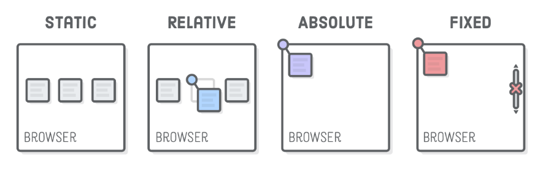
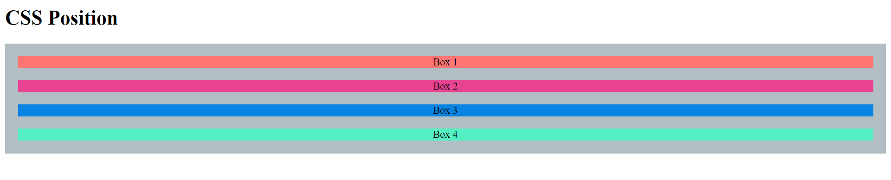
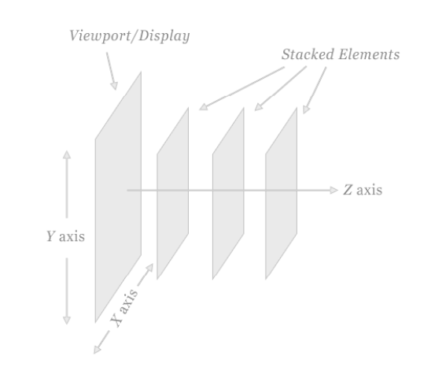
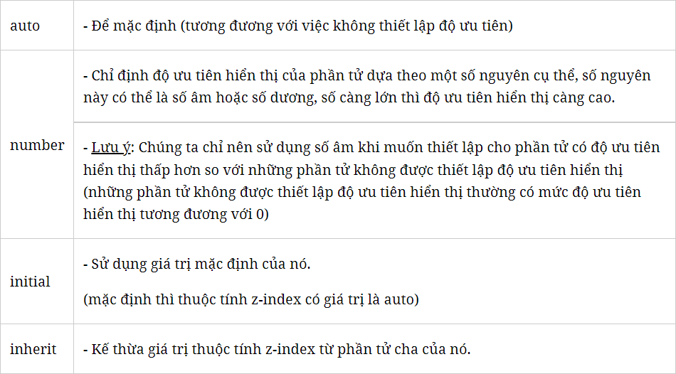
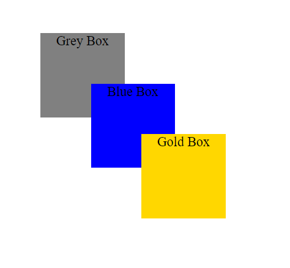
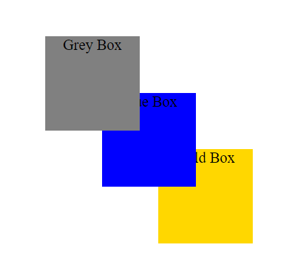
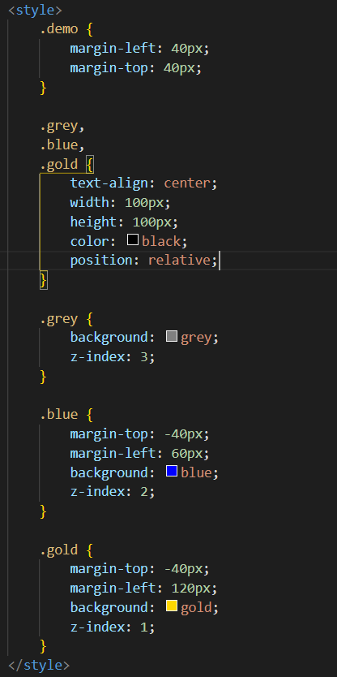

# **I. Position**
- Được sử dụng để định vị vị trí hiển thị của các phần tử thẻ HTML và thường được sử dụng để xây dựng CSS cho menu nhiều cấp, tooltip và một số chức năng khác liên quan đến vị trí.

## **1. Các vị trí trong Position**
    - *Top* - trên
    - *Bottom* - dưới
    - *Left* - trái 
    - *Right* - phải

## **2. 5 giá trị thuộc tính cơ bản của position tron CSS**

- ***Position static***: vị trí mặc định của phần tử và bạn đặt đâu phần tử sẽ nằm ở đó (không thể di chuyển được).
    <!--  -->
    - Không thể sử dụng các thuộc tính như *top*, *left*, *right*, *bottom* để thiết lập vị trí cho phần tử với position static.
- ***Position ralative***: vị trí của phần tử sẽ tương đối so với vị trí mặc định bạn đặt (có thể di chuyển được) và khoảng không gian xung quanh phần tử sẽ được giữ nguyên.

- ***Position absolute***: vị trí của phần tử sẽ được xác định từ padding của phần tử cha (định vị một phần tử trên 1 phần tử khác).
- ***Position fixed***: vị trí sẽ nằm cố định một chỗ, dù bạn có làm gì, phần tử vẫn nằm cố định 1 vị trí trên màn hình.
- ***Position sticky***: vị trí của phần tử sẽ được định vị khi người dùng sử dụng thanh cuộn (là sự kết hợp giữa relative và fixed).
    - **Position sticky** không sử dụng được trên trình duyệt Internet Explorer cũng như một số phiên bản đầu của Edge nên sẽ dễ gây lỗi. 
    - Không khuyển khích sử dụng

# **II. Z-index**
- *z-index* trong css có cách thức hoạt động là mỗi element trên trang web được hiển thị ngang và dọc theo 2 trục x và y, hiển thị thứ tự chồng lấn theo trục z. Nói đơn giản hơn thì *z-index* càng cao thì element đó đứng trước và hiện lên trên.

- Giá trị mặc định là 0. Có thể sử dụng số âm 
- Cú pháp:  ***z-index: value;***
Trong đó **value** có thể được xác định dựa theo 1 trong các giá trị sau:

## 1. Ví dụ về z-index và position
- Chúng ta có 3 khối *grey*, *blue*, *gold* đều trực thuộc trực tiếp 1 div có class *demo*. Điều này giúp cho 3 khối thuộc cùng 1 stacking context. Như vậy trong cùng một stacking context thì thứ tụ trên dưới sẽ tuân theo quy tắc: element nào có *z-index* cao hơn sẽ hiện lên trên. Nếu chưa có một element nào được set *z-index* thì thứ tự sẽ phụ thuộc vào thứ tự xuất hiện từ trước ra sau của DOM(Document Object Model: Mô hình Đối tượng tài liệu) tree.

- Thêm *z-index* vào 3 khối để cho khối *grey* hiện lên phía trước, *blue* nằm giữa và khối *gold* đứng sau 2 khối.

* ***Lưu ý***: *z-index* chỉ có tác dụng với các element khi chỉ định thêm các giá trị position: *absolute*, *fixed*, *relative*.

## 2. Stacking Order
- Mọi element trong HTML có thể ở phía trước hay phía sau các element khác trong document. Đây được gọi là thứ tự xếp lớp (stcking order).
   - Khi chưa xét đến 2 thuộc tính *z-index* và *position* thì thứ tự xếp lớp chỉ có 1 quy luật: thứ tự xếp lớp chính là thứ tự xuất hiện trong HTML.
   - Khi xét đến thuộc tính position thì mọi element được gán position(kể cả các element con của nó) đều xuất hiện phía trước bất kì một element nào mà không được gán position.
   - Element nào có giá trị z-index cao hơn thì sẽ đứng trước element có giá trị z-index thấp hơn.
      - *z-index* chỉ chạy đối với element có gán position.
      - *z-index* có thể tạo ra ***stacking context***
## 3. Stacking Contexts
- Một nhóm các element có chung một element cha sẽ cùng di chuyển với nhau trong *stacking order*, tạo nên khái niệm gọi là *stacking context*
- Mỗi một stacking context sẽ có 1 HTML element là element gốc (root element). Khi một stacking context gắn với một element, nó sẽ liên kết tất cả các element con vào 1 vị trí cố định trong stacking order. Điều đó có nghĩa là nếu 1 element nằm trong 1 stacking context nằm ở dưới cùng của stacking order, sẽ không có cách nào làm cho nó xuất hiện phía trước một element nằm trong 1 stacking context có vị trí cao hơn trong stacking order, ngay cả nếu set z-index của nó tới 9999 !

- Một stacking context có thể được gắn với 1 element bằng 1 trong 3 cách:
    - Khi một element là gốc của document (thẻ <html>)
    - Khi một element có giá trị position được set khác với static và z-index khác auto
    - Khi một element có giá trị opacity nhỏ hơn 1